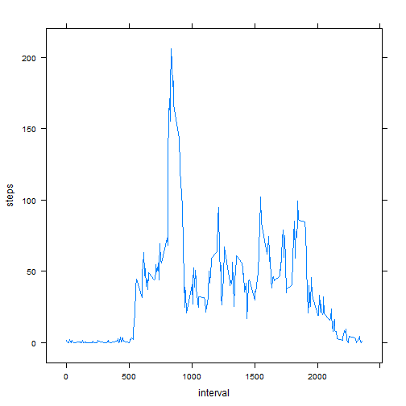

## Loading and preprocessing the data

```r
library(data.table)
setwd("~/R_WD/rprpa1/RepData_PeerAssessment1/")
dt <- fread("activity.csv")
```


## What is mean total number of steps taken per day?

```r
q <- dt[,sum(steps),by=date]
hist(q$V1, col="red", main="Distribution of steps per day", xlab="")
```

 

### Mean and median of total step numbers

```r
print(paste("Mean:", mean(q[!is.na(q$V1),]$V1)))
```

```
## [1] "Mean: 10766.1886792453"
```

```r
print(paste("Median:", median(q[!is.na(q$V1),]$V1)))
```

```
## [1] "Median: 10765"
```

## What is the average daily activity pattern?

```r
library(lattice)
avgAcrossDays <- dt[!is.na(steps),mean(steps), by=interval]
xyplot(V1 ~ interval , avgAcrossDays, type="l", ylab="steps")
```

 


## Imputing missing values

```r
corrDT <- copy(dt)
corrVals <- vector()

for (x in corrDT[is.na(steps), ]$interval )
{ 
    corrVals <- c(corrVals,as.integer(avgAcrossDays[interval == x,]$V1) )
}

corrDT[is.na(steps)]$steps <- corrVals

q <- corrDT[,sum(steps),by=date]
hist(q$V1, col="red", main="Distribution of steps per day", xlab="")
```

 

### Mean and median of total step numbers

```r
print(paste("Mean:", mean(q[!is.na(q$V1),]$V1)))
```

```
## [1] "Mean: 10749.7704918033"
```

```r
print(paste("Median:", median(q[!is.na(q$V1),]$V1)))
```

```
## [1] "Median: 10641"
```

The replacement of NA values by the weekly average for the interval does not appear to have made a significant difference to the mean and median of the step distribution. However, it has shifted the distribution of the total number of steps per day somewhat to the right. 


## Are there differences in activity patterns between weekdays and weekends?

```r
isWd <- function(dayNames) 
{ 
    out <- vector()
    for (dayName in dayNames)
    {
        out <- c(out, ifelse (dayName == "Sunday"||dayName == "Saturday", "weekend", "weekday") )
    }
    
    out
}

corrDT[,weekday :=weekdays(strptime(date,format="%Y-%m-%d"))]
```

```
##        steps       date interval weekday
##     1:     1 2012-10-01        0  Monday
##     2:     0 2012-10-01        5  Monday
##     3:     0 2012-10-01       10  Monday
##     4:     0 2012-10-01       15  Monday
##     5:     0 2012-10-01       20  Monday
##    ---                                  
## 17564:     4 2012-11-30     2335  Friday
## 17565:     3 2012-11-30     2340  Friday
## 17566:     0 2012-11-30     2345  Friday
## 17567:     0 2012-11-30     2350  Friday
## 17568:     1 2012-11-30     2355  Friday
```

```r
corrDT$isWeekday = isWd(corrDT$weekday)
avgAcrossDays <- corrDT[,list(mean(steps),isWeekday), by=list(isWeekday,interval)]
xyplot(V1 ~ interval | isWeekday, avgAcrossDays, type="l", ylab="steps", layout=c(1,2))
```

 
